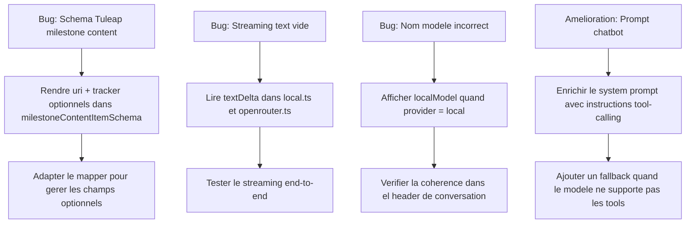

# Plan de correction : Onglet Génération IA & Chatbot

## Diagnostic

### 1. Génération IA — TuleapSchemaError sur `/api/milestones/{id}/content`

**Cause racine** : Le schéma Zod [`artifactSummarySchema`](src/main/tuleap/schemas.ts:83) (alias de `baseArtifactSchema`) exige que `uri` soit un `string` obligatoire et `tracker` un objet obligatoire. Cependant, l'endpoint Tuleap `/api/milestones/{id}/content` retourne des **backlog items** dont la structure diffère des artefacts classiques — les champs `uri` et `tracker` peuvent être absents ou nommés différemment.

**Erreur exacte** :
```
path [0, "uri"]  → expected string, received undefined
path [0, "tracker"] → expected object, received undefined
```

**Fichiers impactés** :
- [`src/main/tuleap/schemas.ts`](src/main/tuleap/schemas.ts:65) — `baseArtifactSchema` ligne 68 (`uri: z.string()`) et ligne 79 (`tracker: z.object(...)`)
- [`src/main/tuleap/client.ts`](src/main/tuleap/client.ts:256) — `listMilestoneContent()` utilise `artifactSummarySchema`

---

### 2. Chatbot — Le texte des réponses affiche « … » (outil appelé mais pas de contenu final)

**Cause racine** : Dans [`src/main/llm/local.ts`](src/main/llm/local.ts:130) et [`src/main/llm/openrouter.ts`](src/main/llm/openrouter.ts:94), le traitement du stream part `text-delta` tente de lire `part.text` ou `part.delta`, mais **AI SDK v6** (`ai@^6.0.176`) expose la propriété sous le nom `textDelta`.

Conséquence : `buffered` reste vide → `provider.stream()` retourne `{ text: '' }` → [`updateMessageContent()`](src/main/ipc/chat.ts:186) n'est jamais appelé avec du contenu réel → le composant [`ChatMessageBubble`](src/renderer/src/components/ChatMessageBubble.tsx:69) affiche le placeholder « … ».

**Fichiers impactés** :
- [`src/main/llm/local.ts`](src/main/llm/local.ts:131) — case `'text-delta'`
- [`src/main/llm/openrouter.ts`](src/main/llm/openrouter.ts:94) — case `'text-delta'`

---

### 3. Chatbot — Nom du modèle incorrect dans le header

**Cause racine** : [`Chatbot.tsx`](src/renderer/src/routes/Chatbot.tsx:140) affiche toujours `config.llmModel` (modèle OpenRouter, par défaut `minimax/minimax-m2:free`) même quand le provider actif est `local`. Il devrait afficher `config.localModel` dans ce cas.

---

### 4. Chatbot — Amélioration du système de prompt et des appels d'outils

Le system prompt actuel dans [`src/main/ipc/chat.ts`](src/main/ipc/chat.ts:42) est fonctionnel mais pourrait être enrichi pour :
- Mieux guider les modèles locaux (souvent moins performants en tool-calling)
- Fournir des descriptions plus structurées des outils disponibles
- Ajouter des exemples d'utilisation

---

## Plan de corrections



---

## Changements détaillés

### A. Fix Schema Tuleap — `schemas.ts` + `client.ts` + `mappers.ts`

1. **Créer un `milestoneContentItemSchema`** dans `schemas.ts` qui rend `uri` et `tracker` optionnels :
   ```ts
   export const milestoneContentItemSchema = z.object({
     id: z.number(),
     uri: z.string().optional().default(''),
     title: z.string().nullable().optional().default(''),
     status: z.string().nullable().optional().default(null),
     submitted_by: z.number().nullable().optional(),
     submitted_by_user: z.object({...}).passthrough().optional(),
     submitted_on: z.string().nullable().optional(),
     last_modified_date: z.string().nullable().optional(),
     html_url: z.string().nullable().optional(),
     tracker: z.object({ id: z.number() }).passthrough().optional()
   }).passthrough()
   ```

2. **Modifier `listMilestoneContent()`** dans `client.ts` pour utiliser `milestoneContentItemSchema` au lieu de `artifactSummarySchema`.

3. **Adapter `mapArtifactSummary()`** dans `mappers.ts` pour gérer `uri` optionnel et `tracker` optionnel (fallback `trackerId: 0`).

### B. Fix Streaming — `local.ts` + `openrouter.ts`

Corriger la lecture du delta dans les deux fichiers :
```ts
case 'text-delta': {
  const delta = (part as unknown as { textDelta?: string }).textDelta ?? ''
  if (delta) {
    buffered += delta
    onChunk({ type: 'text', delta })
  }
  break
}
```

### C. Fix Model Display — `Chatbot.tsx`

Remplacer ligne 140 :
```tsx
Modèle : <code>{config.llmProvider === 'local' ? config.localModel ?? 'local' : config.llmModel}</code>
```

### D. Amélioration System Prompt — `chat.ts`

Enrichir `SYSTEM_PROMPT` avec :
- Instructions explicites sur quand et comment appeler les tools
- Description résumée de chaque tool disponible
- Exemples de patterns d'appels
- Instruction de fallback si le modèle ne supporte pas les tools

---

## Autres erreurs potentielles détectées

| # | Risque | Fichier | Description |
|---|--------|---------|-------------|
| 1 | Moyen | `local.ts:187` | Le provider retourne `buffered` au lieu de lire `await result.text` du SDK — une fois le fix B appliqué, c'est cohérent |
| 2 | Faible | `chat.ts:29-39` | `chatHistoryAsLlmMessages` filtre les messages de role `tool` — OK pour single-turn mais empêche le multi-turn tool context |
| 3 | Faible | `schemas.ts:68` | `baseArtifactSchema.uri` est requis — les endpoints `/api/trackers/{id}/artifacts` pourraient aussi avoir ce souci selon la version Tuleap |
| 4 | Moyen | `openrouter.ts:145-146` | `await result.finishReason` et `await result.usage` doivent être des promises en AI SDK v6 — à vérifier que le await fonctionne |
| 5 | Faible | `Chatbot.tsx:140` | La liste de tools est hardcoded dans le JSX — si on ajoute des tools, il faudra mettre à jour manuellement |

---

## Ordre d'exécution recommandé

1. Fix A (Schema) — débloque complètement l'onglet Génération IA
2. Fix B (Streaming) — restaure l'affichage des réponses dans le Chatbot  
3. Fix C (Model name) — correction cosmétique rapide
4. Fix D (Prompt) — amélioration qualitative
5. Vérification des risques additionnels (items 2-5 du tableau)
