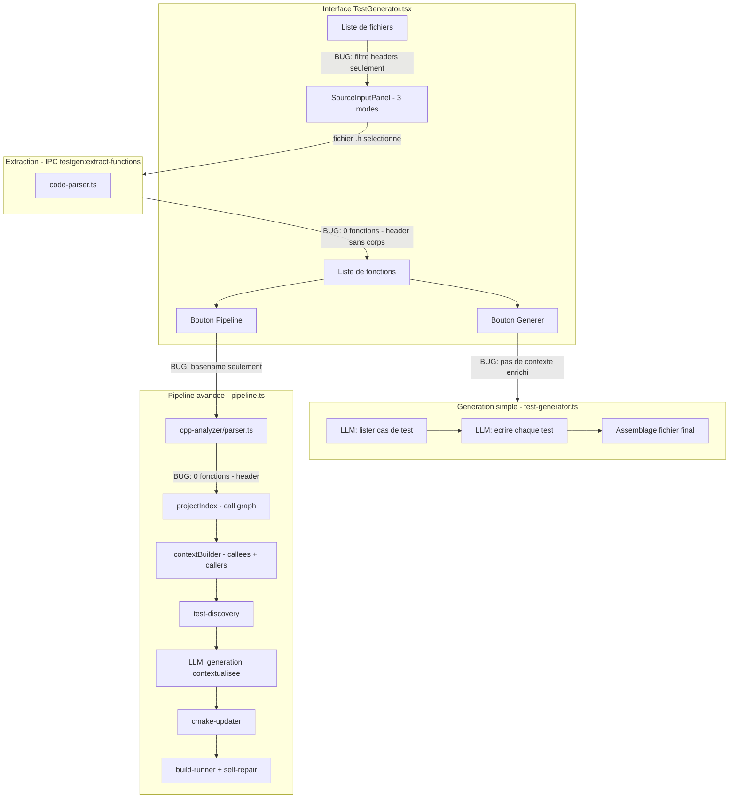
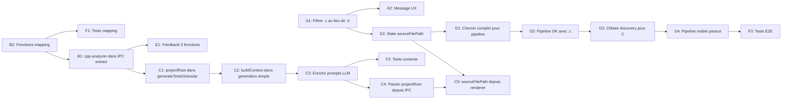

# Plan de correction — Test Generator & Pipeline avancée

## 1. Résumé du besoin

- **Langage cible : C uniquement** (fichiers `.c`)
- **Afficher les fichiers source** (`.c`) dans la liste et pas les headers (`.h`)
- **Contexte enrichi** (callees + callers + header associé) dans TOUTES les générations, comme le Commenter
- **Pipeline avancée** réparée et fonctionnelle (CMake + build + self-repair)

---

## 2. Architecture actuelle et bugs



### Bugs identifiés

| # | Bug | Fichier | Impact |
|---|-----|---------|--------|
| 1 | Filtre `isHeaderFile()` : seuls les `.h` sont listés | `TestGenerator.tsx:174,230` | Aucun fichier `.c` visible |
| 2 | Headers n'ont pas de corps `{}` : 0 fonctions | `code-parser.ts`, `cpp-analyzer/parser.ts` | Rien ne fonctionne après sélection |
| 3 | Génération simple sans contexte enrichi | `test-generator.ts:291` | LLM génère des tests sans connaitre callees/callers |
| 4 | Pipeline reçoit un basename, pas un chemin complet | `TestGenerator.tsx:305` | `resolveSource` échoue ou trouve le header |
| 5 | Pipeline visible uniquement en mode dossier | `TestGenerator.tsx:336` | Caché en modes fichier/git |
| 6 | `cppProjectRoot` potentiellement désynchronisé | `ipc/test-generator.ts:106` | Pipeline pointe vers le mauvais dossier |

---

## 3. Plan de correction

### Phase A — Corriger le filtrage des fichiers (UI)

**A1. Afficher les fichiers `.c` (source) au lieu des `.h` (headers)**

Fichiers à modifier :
- [`TestGenerator.tsx:174`](src/renderer/src/routes/TestGenerator.tsx:174) : remplacer `filter(isHeaderFile)` par un filtre pour les fichiers source (`.c`)
- [`TestGenerator.tsx:230`](src/renderer/src/routes/TestGenerator.tsx:230) : idem pour le mode git
- [`TestGenerator.tsx:42-45`](src/renderer/src/routes/TestGenerator.tsx:42) : renommer/adapter `isHeaderFile` → `isSourceFile`
- [`SourceInputPanel.tsx:185`](src/renderer/src/components/SourceInputPanel.tsx:185) : adapter le message « aucun fichier trouvé » : `Aucun fichier source .c trouvé`

**A2. Accepter aussi les `.c` en drag-drop (mode fichier)**
- [`SourceInputPanel.tsx:12`](src/renderer/src/components/SourceInputPanel.tsx:12) : vérifier que `.c` est dans `SUPPORTED` (déjà le cas, mais le message UX devrait mettre `.c` en avant)

---

### Phase B — Utiliser `cpp-analyzer/parser.ts` pour l'extraction C

**B1. Remplacer `code-parser.ts` par `cpp-analyzer/parser.ts` dans l'IPC extraction**

Fichier : [`src/main/ipc/test-generator.ts:16-26`](src/main/ipc/test-generator.ts:16)

Actuellement :
```ts
import { extractFunctions } from '../test-generator/test-generator'
// ...
const result = extractFunctions(content, filename)
return { functions: result.functions, fileInfo: result.fileInfo }
```

Remplacer par :
```ts
import { parseFile } from '../cpp-analyzer/parser'
// ...
const defs = parseFile(filePath, content) // cpp-analyzer parser
// Mapper FunctionDef → ParsedFunction pour compatibilité UI
const functions = defs.map(d => ({
  name: d.name,
  signature: d.signature,
  returnType: extractReturnType(d.signature),
  lineNumber: d.startLine,
  sourceCode: d.body,
  parameters: extractParams(d.signature),
  description: `${d.qualifiedName} (${d.filePath}:${d.startLine})`
}))
```

Garder `code-parser.ts` pour Python uniquement (branchement `if .py`).

**B2. Créer les fonctions utilitaires de mapping**

Fichier : nouveau `src/main/test-generator/fn-adapter.ts`

```ts
export function functionDefToParsed(def: FunctionDef): ParsedFunction { ... }
export function extractReturnType(signature: string): string { ... }
export function extractParams(signature: string): { name: string; type: string }[] { ... }
```

---

### Phase C — Intégrer le contexte enrichi dans la génération simple

C'est le changement majeur. Actuellement [`generateTestsGranular()`](src/main/test-generator/test-generator.ts:291) envoie juste le `sourceCode` brut au LLM. Il faut y ajouter le contexte comme le fait la pipeline.

**C1. Accepter un `projectRoot` optionnel dans `generateTestsGranular`**

Fichier : [`src/main/test-generator/test-generator.ts`](src/main/test-generator/test-generator.ts:291)

Ajouter un paramètre `projectRoot?: string` et `sourceFilePath?: string` :
```ts
export async function generateTestsGranular(
  content: string,
  filename: string,
  onlyFunctions?: string[],
  onProgress?: (...) => void,
  projectRoot?: string,      // NEW
  sourceFilePath?: string     // NEW
): Promise<GranularResult>
```

**C2. Si `projectRoot` fourni, construire l'index et le contexte enrichi**

Dans [`generateTestsGranular()`](src/main/test-generator/test-generator.ts:296), ajouter :
```ts
let index: ProjectIndex | null = null
if (projectRoot) {
  index = buildProjectIndex(projectRoot)
}
```

Puis pour chaque fonction, avant d'appeler le LLM :
```ts
if (index && sourceFilePath) {
  const fnDef = findFunction(index, func.name, sourceFilePath)
  if (fnDef) {
    const context = buildContext(index, fnDef, { depth: 3, tokenBudget: 12000 })
    const contextText = renderContext(context)
    // Injecter contextText dans le prompt LLM
  }
}
```

**C3. Enrichir les prompts LLM avec le contexte**

Fichier : [`src/main/test-generator/test-generator.ts`](src/main/test-generator/test-generator.ts:45)

Modifier `LIST_TESTS_C_PROMPT` pour inclure une section contexte optionnelle :
```
CONTEXTE DU PROJET :
{context}

(Sous-fonctions appelées par {function_name}, et fonctions qui appellent {function_name})
```

Modifier `WRITE_TEST_C_PROMPT` de la même manière.

**C4. Passer le `projectRoot` depuis l'IPC**

Fichier : [`src/main/ipc/test-generator.ts:28`](src/main/ipc/test-generator.ts:28)

Dans le handler `testgen:generate-all`, récupérer le `cppProjectRoot` et le passer :
```ts
const root = getCppProjectRoot()
const result = await generateTestsGranular(
  content, filename, onlyFunctions, undefined, root, sourceFilePath
)
```

**C5. Transmettre le `sourceFilePath` depuis le renderer**

Fichier : [`TestGenerator.tsx:274`](src/renderer/src/routes/TestGenerator.tsx:274)

Ajouter le chemin complet du fichier source dans l'appel API :
```ts
const result = await api.testgen.generateAll({
  filename,
  content,
  onlyFunctions: [...selectedFunctions],
  sourceFilePath  // NEW: chemin absolu
})
```

Fichier : [`src/preload/index.ts:402`](src/preload/index.ts:402) — ajouter `sourceFilePath` dans le type args.

---

### Phase D — Réparer la pipeline avancée

**D1. Transmettre le chemin complet du fichier au pipeline**

Fichier : [`TestGenerator.tsx:298-328`](src/renderer/src/routes/TestGenerator.tsx:298)

En mode dossier, `cppProject.path + selectedFolderFile` donne le chemin absolu. Envoyer directement ce chemin au pipeline au lieu de passer par `resolveSource()` :
```ts
const onRunPipeline = async () => {
  if (!cppProject.path || !selectedFolderFile) return
  const sourceFilePath = `${cppProject.path}/${selectedFolderFile}`
  // ...
  const result = await api.testgen.runPipeline({
    sourceFilePath,
    // ...
  })
}
```

**D2. S'assurer que la pipeline gère les fichiers `.c` correctement**

Fichier : [`src/main/test-generator/pipeline.ts:177-178`](src/main/test-generator/pipeline.ts:177)

`parseFile()` et `buildProjectIndex()` fonctionnent déjà avec les `.c` — le module `pairing.ts` gère les extensions `.c` → `.h`. Vérifier que `discoverTests()` detecte bien les patterns gtest dans un contexte C pur.

**D3. Adapter `discoverCMake` pour les projets C**

Fichier : [`src/main/test-generator/cmake-discovery.ts`](src/main/test-generator/cmake-discovery.ts:25)

Vérifier que la discovery fonctionne avec des projets C (pas seulement C++). Les patterns gtest sont les mêmes en C et C++, donc pas de changement attendu, mais à valider.

**D4. Rendre la pipeline accessible en mode fichier aussi**

Fichier : [`TestGenerator.tsx:336`](src/renderer/src/routes/TestGenerator.tsx:336)

Changer la condition de visibilité :
```ts
const showPipeline = !isPython && projectReady
// Au lieu de : sourceMode === 'folder' && !isPython
```

Quand en mode fichier ou git, si un `cppProjectRoot` est configuré, résoudre le fichier dans le projet avec `resolveSource`.

---

### Phase E — UI polish

**E1. Feedback quand 0 fonctions trouvées**

Fichier : [`TestGenerator.tsx:432-436`](src/renderer/src/routes/TestGenerator.tsx:432)

Améliorer le message pour distinguer :
- « Aucune fonction trouvée (fichier header sans implémentation ? Sélectionnez le .c correspondant) »
- « Aucune fonction trouvée (erreur de parsing) »

**E2. Stocker le chemin absolu du fichier sélectionné**

Actuellement `filename` ne contient que le basename. Ajouter un state `sourceFilePath` dans `TestGenerator.tsx` pour stocker le chemin complet (nécessaire pour Phase C et D).

---

### Phase F — Tests

**F1. Test unitaire pour le mapping `FunctionDef` → `ParsedFunction`**

Fichier : nouveau `tests/test-generator/fn-adapter.test.ts`

**F2. Test unitaire : contexte enrichi dans la génération simple**

Vérifier que quand `projectRoot` est fourni, le prompt contient bien les callees/callers.

**F3. Adapter le test E2E pipeline**

Fichier : [`tests/e2e/test-generator-pipeline.test.ts`](tests/e2e/test-generator-pipeline.test.ts)

- Tester avec un fichier `.c` en entrée
- Vérifier la résolution de chemin complet

---

## 4. Ordre d'exécution



**Priorité critique (rend le système fonctionnel) :**
1. A1 → Afficher les `.c`
2. E2 → Stocker le chemin complet
3. B2 + B1 → Utiliser `cpp-analyzer/parser.ts`
4. C1→C5 → Contexte enrichi dans la génération simple
5. D1→D4 → Pipeline fonctionnelle

**Polish (améliorations) :**
6. A2, E1 → Messages utilisateur
7. F1→F3 → Tests

---

## 5. Fichiers impactés

| Fichier | Phases | Type de modif |
|---------|--------|---------------|
| `src/renderer/src/routes/TestGenerator.tsx` | A1, D1, D4, E1, E2 | Filtrage + state + pipeline |
| `src/renderer/src/components/SourceInputPanel.tsx` | A1, A2 | Message UX |
| `src/main/ipc/test-generator.ts` | B1, C4 | Parser + projectRoot |
| `src/main/test-generator/test-generator.ts` | C1, C2, C3 | Contexte enrichi |
| `src/main/test-generator/fn-adapter.ts` | B2 | **Nouveau fichier** |
| `src/preload/index.ts` | C5 | Ajouter sourceFilePath dans types |
| `src/main/test-generator/pipeline.ts` | D2 | Vérification .c |
| `tests/test-generator/fn-adapter.test.ts` | F1 | **Nouveau fichier** |
| `tests/e2e/test-generator-pipeline.test.ts` | F3 | Adapter pour .c |
