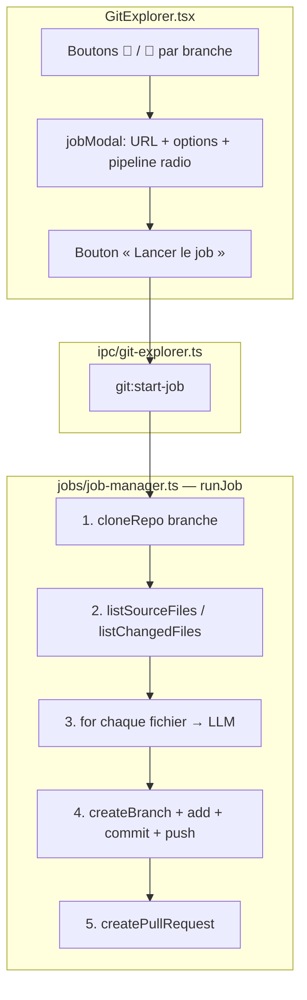
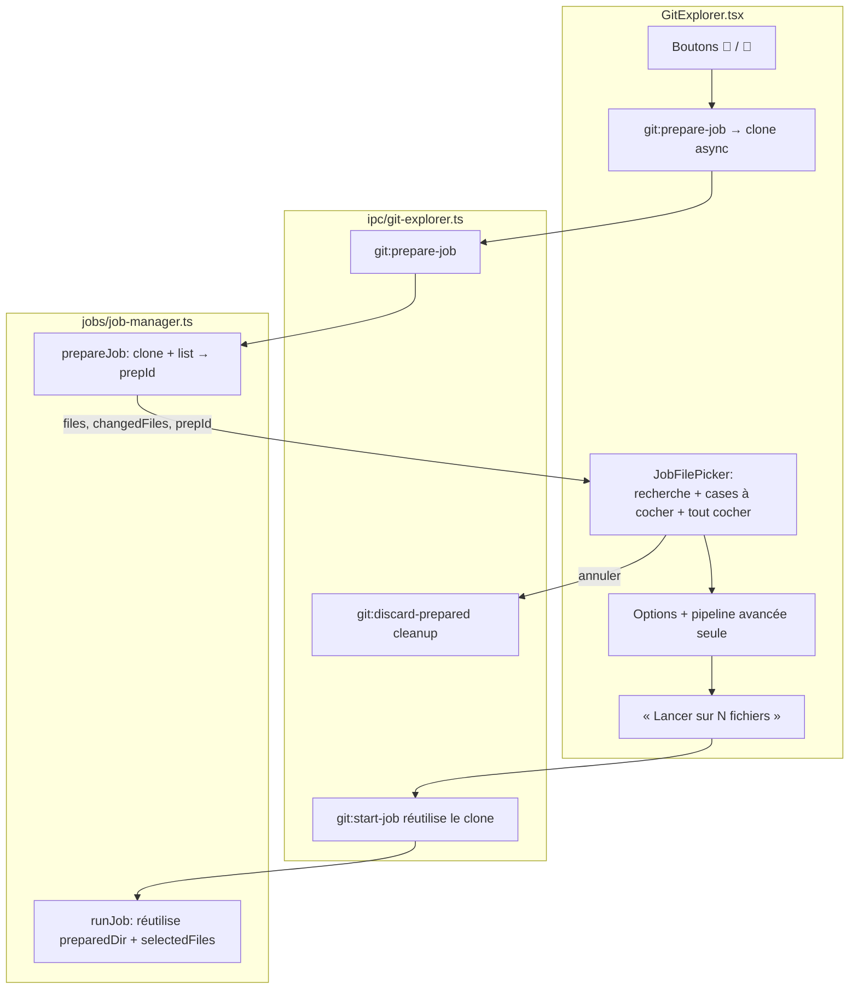
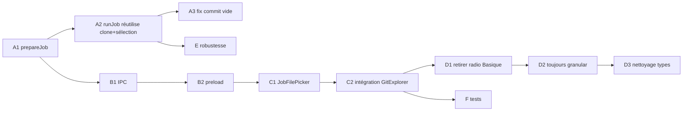

# Plan — Sélection de fichiers dans la boucle Git Explorer (Commentateur / Tests)

> **Statut : implémenté.** Clone asynchrone (`prepareJob`) + sélecteur de fichiers
> (recherche, cases à cocher, tout cocher/décocher), suppression de la pipeline de
> tests « Basique », correction du commit vide. **Ajout :** option de portée des
> commentaires — *en-tête de fonction uniquement* vs *commentaires dans le corps
> des fonctions* (champ `inlineComments`, appliqué aux deux pipelines).

## 1. Résumé du besoin

Dans **Git Explorer** (« git tree »), quand l'utilisateur lance le **Commentateur** (💬)
ou le **Générateur de tests** (🧪) sur une branche :

1. **Cloner le dépôt en asynchrone** *avant* de lancer le traitement.
2. **Afficher un menu de sélection de fichiers** une fois le clone terminé :
   - une **barre de recherche** pour filtrer,
   - une **liste à cases à cocher** (ajouter / retirer un fichier du job),
   - une case **« Tout cocher / Tout décocher »**.
3. Ne traiter que **les fichiers sélectionnés** (et non plus tout le dépôt).
4. **Supprimer la pipeline « Basique »** du générateur de tests (garder l'« Avancée »
   call-graph uniquement).

---

## 2. Architecture actuelle



**Point clé :** le clone et la liste des fichiers se font *dans* `runJob`, après
fermeture du modal. L'utilisateur ne voit jamais la liste des fichiers et ne peut
pas en choisir un sous-ensemble — la boucle traite **tout** `listSourceFiles()`
(ou tous les fichiers modifiés si `onlyChangedFiles`).

Fichiers concernés :
- [`src/renderer/src/routes/GitExplorer.tsx`](../src/renderer/src/routes/GitExplorer.tsx) — UI + modal de lancement
- [`src/main/jobs/job-manager.ts`](../src/main/jobs/job-manager.ts) — `runJob` (clone + boucle)
- [`src/main/ipc/git-explorer.ts`](../src/main/ipc/git-explorer.ts) — handler `git:start-job`
- [`src/main/commenter/git-utils.ts`](../src/main/commenter/git-utils.ts) — `cloneRepo`, `listSourceFiles`, `listChangedFiles`
- [`src/preload/index.ts`](../src/preload/index.ts) — API `gitExplorer`
- [`src/shared/types.ts`](../src/shared/types.ts) — `CommentingOptions`, `JobType`

---

## 3. Bugs / cas qui ne fonctionnent pas dans la boucle actuelle

Analyse de `runJob` ([`job-manager.ts:90-284`](../src/main/jobs/job-manager.ts)) :

| # | Cas | Localisation | Impact |
|---|-----|--------------|--------|
| 1 | **Commit vide** : si tous les fichiers sont ignorés (`skipped == files.length`), le code appelle quand même `createBranch` → `gitAdd` → `gitCommit`. `git commit` échoue (« nothing to commit »). | [`job-manager.ts:239-251`](../src/main/jobs/job-manager.ts#L239) | Le job meurt à l'étape *committing* avec une erreur git obscure au lieu d'un message clair. |
| 2 | **Aucune sélection possible** : la boucle traite tout `listSourceFiles()`. | [`job-manager.ts:134-146`](../src/main/jobs/job-manager.ts#L134) | Impossible de cibler 2-3 fichiers ; clone + LLM sur tout le repo (lent, coûteux). |
| 3 | **`useContextPipeline` rend la boucle inutile mais émet quand même la progression** : le `for` ne fait rien pour le commentateur contextuel, puis `runContextCommenter` tourne après — avec un canal de progression *différent* (`commenter:context-progress`). | [`job-manager.ts:196-235`](../src/main/jobs/job-manager.ts#L196) | Double barre de progression incohérente (la 1ʳᵉ avance sans rien faire). |
| 4 | **Skip des fichiers de test basé sur le basename seul** : `/test/i.test(basename)` ignore `foo_test.c` mais **pas** `tests/foo.c`. | [`job-manager.ts:165`](../src/main/jobs/job-manager.ts#L165) | Comportement incohérent ; combiné à `onlyChangedFiles`, peut tout ignorer → cas #1. |
| 5 | **Échecs par fichier silencieux** : un `throw` par fichier ne fait qu'incrémenter `skipped` + `debugError`. Le tableau `errors` de `processMultipleFiles` n'est pas réutilisé (la boucle est réécrite inline). | [`job-manager.ts:189-205`](../src/main/jobs/job-manager.ts#L189) | L'utilisateur ne sait jamais **quels** fichiers ont échoué ni **pourquoi**. |
| 6 | **Pipeline tests « Basique » de faible qualité** : `generateTestsForFile` = 1 appel LLM, sans contexte projet, sans CMake/build/self-repair, écrit la sortie même vide. | [`job-manager.ts:184-187`](../src/main/jobs/job-manager.ts#L184), [`test-gen-file.ts`](../src/main/jobs/test-gen-file.ts) | Tests souvent non compilables → à **supprimer**. |
| 7 | **Clone dans le job** : la liste des fichiers n'existe qu'au runtime du job. | [`job-manager.ts:114-146`](../src/main/jobs/job-manager.ts#L114) | Empêche structurellement toute sélection en amont (cf. #2). |

---

## 4. Nouvelle architecture cible



Le clone n'est exécuté **qu'une fois** : la préparation pose le dossier, le job le
réutilise. Annuler le picker nettoie le dossier préparé.

---

## 5. Plan d'implémentation

### Phase A — Backend : préparation (clone async) + liste des fichiers

**A1. `prepareJob` dans `job-manager.ts`**

Nouvelle fonction qui clone et liste, sans lancer la boucle :

```ts
type PreparedJob = {
  prepId: string
  dir: string
  files: string[]         // listSourceFiles
  changedFiles: string[]  // listChangedFiles (intersection avec files)
  createdAt: number
}
const preparedJobs = new Map<string, PreparedJob>()

export async function prepareJob(args: {
  repoName: string; cloneUrl: string; branchName: string
}): Promise<{ prepId: string; files: string[]; changedFiles: string[] }> {
  const { tempClonePath } = getConfig()
  if (!tempClonePath) throw new Error('Aucun dossier temporaire configuré.')
  const prepId = makeJobId()
  const dir = path.join(tempClonePath, `${args.repoName}_prep_${prepId}`)
  const credUrl = await injectGitCredentials(args.cloneUrl)
  try { await cloneRepo(credUrl, dir, args.branchName) }
  catch (e) { throw new Error(explainGitAuthFailure(...) ?? raw) }
  const files = await listSourceFiles(dir)
  const changed = new Set(await listChangedFiles(dir))
  preparedJobs.set(prepId, { prepId, dir, files,
    changedFiles: files.filter(f => changed.has(f)), createdAt: Date.now() })
  return { prepId, files, changedFiles: [...] }
}

export function discardPreparedJob(prepId: string): void {
  const p = preparedJobs.get(prepId)
  if (p) { fs.rmSync(p.dir, { recursive: true, force: true }); preparedJobs.delete(prepId) }
}
```

> Prévoir un **TTL/garbage collector** (ex. nettoyage des `preparedJobs` > 30 min)
> pour éviter les dossiers orphelins si l'utilisateur ne confirme jamais.

**A2. Refactor `runJob` pour réutiliser un clone préparé + filtrer les fichiers**

- Ajouter à `JobStartArgs` : `prepId?: string` et `selectedFiles?: string[]`.
- Si `prepId` fourni : `targetDir = prepared.dir`, **sauter** `cloneRepo`
  ([`job-manager.ts:114-123`](../src/main/jobs/job-manager.ts#L114)).
- Remplacer la liste source par la sélection :
  ```ts
  let files = args.selectedFiles?.length
    ? args.selectedFiles
    : await listSourceFiles(targetDir)
  ```
  (Conserver `onlyChangedFiles` comme filtre additionnel si aucune sélection
  explicite, pour compat ascendante.)
- À la fin (`finally`), nettoyer aussi l'entrée `preparedJobs` (le `cleanupDir`
  existant supprime déjà le dossier).

**A3. Corriger le commit vide (bug #1)**

Avant `createBranch` :
```ts
if (processed === 0) {
  throw new Error(`Aucun fichier traité (${skipped} ignoré(s)). Rien à committer.`)
}
```
Message clair au lieu d'un échec `git commit`.

---

### Phase B — IPC + preload

**B1. `ipc/git-explorer.ts`** — nouveaux handlers :
```ts
ipcMain.handle('git:prepare-job', (_e, args) => prepareJob(args))
ipcMain.handle('git:discard-prepared', (_e, prepId: string) => discardPreparedJob(prepId))
```
Étendre `git:start-job` pour transmettre `prepId` + `selectedFiles`.

**B2. `preload/index.ts`** — étendre l'objet `gitExplorer` :
```ts
prepareJob: (args: { repoName: string; cloneUrl: string; branchName: string }):
  Promise<{ prepId: string; files: string[]; changedFiles: string[] }> =>
  ipcRenderer.invoke('git:prepare-job', args),
discardPrepared: (prepId: string): Promise<void> =>
  ipcRenderer.invoke('git:discard-prepared', prepId),
startJob: (args: { /* … */ prepId?: string; selectedFiles?: string[] }) => …
```

---

### Phase C — UI : composant `JobFilePicker`

**C1. Nouveau composant** `src/renderer/src/components/JobFilePicker.tsx`

Props : `{ files, changedFiles, value: Set<string>, onChange, loading }`.

Contenu :
- **Barre de recherche** (`input`) filtrant `files` (insensible à la casse,
  match sur le chemin).
- **Case maître « Tout cocher / Tout décocher »** : `checked` = tous les fichiers
  *visibles (filtrés)* sont sélectionnés ; état `indeterminate` si partiel ;
  bascule l'ensemble des fichiers filtrés.
- **Liste à cases à cocher** (scrollable) : une ligne `<label><input checkbox>chemin</label>`
  par fichier filtré, avec badge « modifié » pour `changedFiles`.
- **Raccourcis** : boutons « Sélectionner les fichiers modifiés » / « Aucun ».
- **Compteur** : « N / M fichiers sélectionnés ».

Réutiliser les patterns existants (`ui/input`, `ui/button`, classes Tailwind du
projet, cf. [`CommentingOptionsPanel.tsx`](../src/renderer/src/components/CommentingOptionsPanel.tsx)).

**C2. Intégration dans `GitExplorer.tsx`**

Remplacer le `jobModal` actuel par un flux à 2 temps :

1. `openModal(type, branch)` → appelle `api.gitExplorer.prepareJob(...)`
   (état `preparing`), affiche le modal avec un **spinner « Clonage… »**.
2. À la résolution, stocker `{ prepId, files, changedFiles }` et afficher le
   `JobFilePicker` + le `CommentingOptionsPanel` (commentateur) ou le bloc
   d'options de tests (sans le radio « Basique »).
3. **Lancer** → `api.gitExplorer.startJob({ …, prepId, selectedFiles: [...sel] })`.
4. **Annuler / fermer** → `api.gitExplorer.discardPrepared(prepId)`.

État local proposé :
```ts
type JobModal = {
  type: JobType; repo: GitRepository; branch: string; cloneUrlOverride: string
  options: CommentingOptions
  phase: 'preparing' | 'ready' | 'error'
  prepId?: string; files: string[]; changedFiles: string[]
  selected: Set<string>; error?: string
}
```
Bouton « Lancer » désactivé si `selected.size === 0`.

---

### Phase D — Supprimer la pipeline « Basique » (tests)

**D1. `GitExplorer.tsx`** — retirer le bloc radio Basique/Avancée
([`GitExplorer.tsx:521-566`](../src/renderer/src/routes/GitExplorer.tsx#L521)).
Garder uniquement la case « Fichiers modifiés uniquement » (ou la remplacer par le
picker). `DEFAULT_OPTIONS.testPipelineMode` → `'advanced'` (ou champ retiré).

**D2. `job-manager.ts`** — supprimer la branche `else { generateTestsForFile… }`
([`job-manager.ts:177-188`](../src/main/jobs/job-manager.ts#L177)). Toujours
`generateTestsGranular`. Retirer l'import `test-gen-file`.

**D3. Nettoyage** — `testPipelineMode` n'est utilisé **que** dans ce flux
(vérifié : GitExplorer + job-manager). Options :
- soit retirer `testPipelineMode` de `CommentingOptions` ([`types.ts:338`](../src/shared/types.ts#L338)),
- soit le conserver mais figé à `'advanced'`.
Supprimer `src/main/jobs/test-gen-file.ts` si plus aucun import (à confirmer au moment du dev).

---

### Phase E — Corrections de robustesse (bugs #3-#5)

- **#5** Remonter les échecs par fichier : émettre un événement
  `{ type: 'file-error', jobId, file, error }` (ou agréger dans `done`) pour les
  afficher dans `JobsOverlay`.
- **#3** Quand `useContextPipeline`, **ne pas** émettre la progression par fichier
  de la boucle (laisser `commenter:context-progress` piloter l'UI), ou unifier les
  deux canaux.
- **#4** Uniformiser le skip des fichiers de test (chemin complet + dossiers
  `tests/`), ou s'appuyer sur la sélection explicite de l'utilisateur (qui rend ce
  filtre largement caduc).

---

### Phase F — Tests

- **F1** `tests/jobs/prepare-job.test.ts` : clone + liste, `discardPreparedJob`
  nettoie le dossier, TTL.
- **F2** `runJob` avec `prepId` + `selectedFiles` ne reclone pas et ne traite que
  la sélection (mock `cloneRepo` / `listSourceFiles`).
- **F3** Commit vide → erreur claire (bug #1).
- **F4** (UI) `JobFilePicker` : recherche filtre, « tout cocher » respecte le
  filtre, état `indeterminate`.

---

## 6. Ordre d'exécution



**Critique (rend la fonctionnalité utilisable) :** A1 → A2 → A3 → B1/B2 → C1 → C2.
**Demandé en parallèle :** D1 → D2 → D3 (suppression Basique).
**Polish :** E (robustesse), F (tests).

---

## 7. Fichiers impactés

| Fichier | Phases | Modification |
|---------|--------|--------------|
| `src/main/jobs/job-manager.ts` | A1, A2, A3, D2, E | `prepareJob`/`discardPreparedJob`, réutilisation clone, filtre sélection, fix commit vide, granular only |
| `src/main/ipc/git-explorer.ts` | B1 | handlers `git:prepare-job` / `git:discard-prepared`, args `start-job` |
| `src/preload/index.ts` | B2 | API `prepareJob`, `discardPrepared`, args `startJob` |
| `src/shared/types.ts` | A2, D3 | `prepId`/`selectedFiles`, `testPipelineMode` |
| `src/renderer/src/components/JobFilePicker.tsx` | C1 | **Nouveau** : recherche + cases + tout cocher |
| `src/renderer/src/routes/GitExplorer.tsx` | C2, D1 | flux clone→picker→lancer, suppression radio Basique |
| `src/main/jobs/test-gen-file.ts` | D2, D3 | **À supprimer** si plus d'import |
| `tests/jobs/*`, `tests/...` | F | nouveaux tests |
