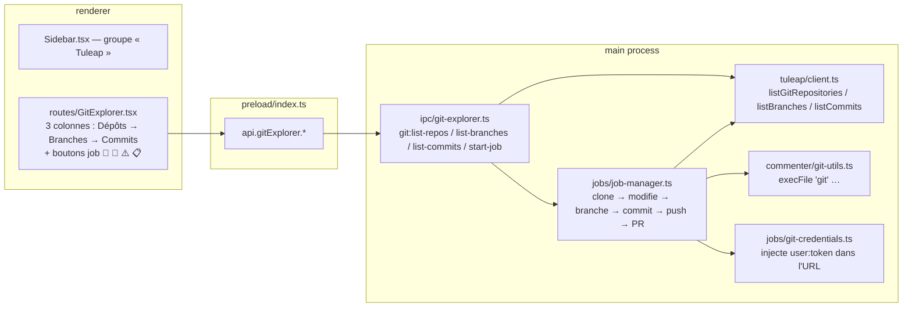

# Étude — Intégration SVN (TortoiseSVN) en complément de Git

> **Statut : étude de faisabilité + plan.** Aucun code n'est encore écrit. Ce
> document répond à la question « peut-on créer une section *SVN Explorer*
> comparable au *Git Explorer* ? » et décrit le plan d'implémentation.

## 1. Question posée

L'équipe utilise **TortoiseSVN**. On veut savoir :

1. Le **CLI SVN** est-il disponible / utilisable comme on shell-out déjà `git` ?
2. Peut-on créer une **nouvelle section comparable au Git Explorer** (liste
   dépôts → branches → commits + lancement de jobs IA) mais branchée sur SVN ?

**Réponse courte : oui aux deux**, avec une réserve structurante — SVN n'a pas
de *pull requests*, donc l'étape finale de la boucle de job (push branche → PR)
doit être repensée (cf. §5 et §7).

---

## 2. Verdict de faisabilité

### 2.1 CLI SVN — disponible ✅

- TortoiseSVN embarque le client ligne de commande **`svn.exe`** en tant que
  **composant optionnel de l'installeur** (« command line client tools »).
  Coché, il s'installe dans `C:\Program Files\TortoiseSVN\bin` et expose
  `svn.exe` / `svnmucc.exe` / `svnversion.exe`. Il faut soit l'ajouter au
  `%PATH%`, soit en configurer le chemin dans l'app.
- À défaut, le client Apache Subversion standalone (SlikSVN, CollabNet) expose
  le même binaire `svn`. **`TortoiseProc.exe`** (pilotage de la GUI) existe aussi
  mais n'est pas scriptable proprement → on vise **`svn` CLI**, pas TortoiseProc.
- L'app shell-out déjà `git` via `execFile` (voir
  [`src/main/commenter/git-utils.ts`](../src/main/commenter/git-utils.ts) :
  `execFileAsync('git', …)`). **Le même pattern `execFile('svn', …)` s'applique
  tel quel** — `shell: false`, args en tableau, pas d'injection.
- ⚠️ Point d'attention : `svn` n'est **pas garanti dans le `%PATH%`** (composant
  optionnel). Il faut une **détection + réglage du chemin** (cf. §6.1), à l'image
  de ce que fait déjà l'app pour Chromium (`MARP_CHROME_PATH`).

### 2.2 API REST Tuleap SVN — disponible ✅ (sous condition)

Tuleap expose un plugin SVN avec des endpoints REST :

| Endpoint | Usage |
|---|---|
| `GET /projects/{id}/svn` | **Liste paginée** des dépôts SVN du projet (paginé via `X-PAGINATION-SIZE`, comme `…/git`) |
| `GET /svn/{id}` | Détail d'un dépôt (id, name, …) |
| `POST /svn`, `PUT /svn/{id}` | Administration (création, hooks) — hors scope |

C'est **exactement le miroir** de `GET /projects/{id}/git` déjà utilisé par
[`client.listGitRepositories`](../src/main/tuleap/client.ts) (l.451). Réserves :

- Le **plugin SVN doit être activé** côté instance Tuleap (comme le plugin Git).
- L'API REST SVN **n'expose ni « branches » ni « liste de commits »** : en SVN,
  les branches/tags sont de **simples répertoires** (`trunk/`, `branches/x`,
  `tags/y`). On les obtient via le **CLI** (`svn list URL`), pas via REST. Idem
  pour l'historique : `svn log URL` (le CLI peut interroger l'URL distante
  **sans checkout**, contrairement à git).

> À valider sur l'instance cible : champ exact contenant l'URL de checkout dans
> la réponse `GET /projects/{id}/svn` (Tuleap varie selon versions, exactement
> comme pour git — d'où le helper tolérant
> [`resolveCloneUrl`](../src/main/tuleap/clone-url.ts)). On répliquera la même
> stratégie « essaye plusieurs champs puis fallback construit depuis l'URL
> instance + path ».

---

## 3. Architecture actuelle du Git Explorer (le modèle à copier)



Surface concernée (tout est dupliquable) :

| Couche | Fichier git | Équivalent SVN à créer |
|---|---|---|
| Nav | [`components/Sidebar.tsx`](../src/renderer/src/components/Sidebar.tsx) (`/git`) | ajouter entrée `/svn` |
| Route | [`routes/GitExplorer.tsx`](../src/renderer/src/routes/GitExplorer.tsx) | `routes/SvnExplorer.tsx` |
| Router | [`renderer/src/main.tsx`](../src/renderer/src/main.tsx) | route `svn` |
| API preload | [`preload/index.ts`](../src/preload/index.ts) `gitExplorer` | bloc `svnExplorer` |
| Typage API | [`lib/api.ts`](../src/renderer/src/lib/api.ts) | `api.svnExplorer` |
| IPC main | [`ipc/git-explorer.ts`](../src/main/ipc/git-explorer.ts) | `ipc/svn-explorer.ts` (+ enregistrer dans [`ipc/index.ts`](../src/main/ipc/index.ts)) |
| Client REST | [`tuleap/client.ts`](../src/main/tuleap/client.ts) | `listSvnRepositories` + `svnRepositorySchema` |
| Résolution URL | [`tuleap/clone-url.ts`](../src/main/tuleap/clone-url.ts) | `resolveSvnUrl` |
| CLI bas-niveau | [`commenter/git-utils.ts`](../src/main/commenter/git-utils.ts) | `svn-utils.ts` (`execSvn`, `svnCheckout`, `svnLog`, `svnList`, `svnCommit`) |
| Jobs | [`jobs/job-manager.ts`](../src/main/jobs/job-manager.ts) | brancher un mode `vcs: 'git' \| 'svn'` |
| Creds | [`jobs/git-credentials.ts`](../src/main/jobs/git-credentials.ts) | flags `--username/--password` SVN |
| Config | [`store/config.ts`](../src/main/store/config.ts) | `svnPath`, `svnLayout`… |
| Types | [`shared/types.ts`](../src/shared/types.ts) | `SvnRepository`, `SvnPathEntry`, `SvnCommit` |

---

## 4. Correspondance des concepts Git ↔ SVN

| Concept Git | Équivalent SVN | Impact |
|---|---|---|
| `git clone --depth 1 <url> -b <branch>` | `svn checkout <url>/<chemin>` | checkout d'**un chemin** (souvent `trunk`), pas du dépôt entier |
| Branches (REST `listBranches`) | répertoires `branches/*`, `tags/*` (CLI `svn list <url>/branches`) | **pas de REST** → CLI requis |
| Liste de commits (REST limité au tip) | `svn log <url>` (URL distante, sans checkout) | **mieux que git** : historique complet sans cloner |
| `git add . && commit && push` | `svn commit -m …` (commit direct sur le serveur) | **pas d'étage local** : commit = publication immédiate |
| **Pull Request** (`createPullRequest`) | **❌ n'existe pas en SVN** | cf. §5 — décision de design |
| SHA commit | numéro de révision `rNNN` | adapter l'affichage |
| Auth = `user:token@url` | flags `--username U --password P --non-interactive` | cf. §6.2 |

---

## 5. Le vrai point dur : pas de Pull Request en SVN

La boucle de job actuelle ([`job-manager.ts`](../src/main/jobs/job-manager.ts)
l.173-233) se termine par : créer une branche `tuleap-pet/…` → `git push` →
`createPullRequest`. **SVN n'a pas de PR.** Trois stratégies possibles :

1. **Commit direct sur une branche SVN dédiée** *(recommandé)*
   - `svn copy <url>/trunk <url>/branches/tuleap-pet-<id> -m "…"` (création
     branche côté serveur), `svn checkout` de cette branche, modifications,
     `svn commit`.
   - On référence l'artéfact Tuleap dans le message (`refs #<id>` — Tuleap relie
     automatiquement commits SVN et artéfacts). **Pas de PR**, mais une branche
     isolée que l'humain peut relire/merger avec TortoiseMerge.
   - Avantage : ne touche jamais `trunk` automatiquement (sécurité IA).

2. **Commit direct sur `trunk`** : simple mais risqué (l'IA écrit en prod). À
   réserver à un mode « expert » opt-in avec confirmation.

3. **Produire un patch `.diff` sans committer** (`svn diff > x.patch`) : l'app
   génère le patch, l'utilisateur l'applique via TortoiseSVN. Zéro risque,
   workflow le plus proche d'une « PR » revue à la main.

> **Recommandation** : implémenter **(1)** par défaut + **(3)** en option (« ne
> pas committer, générer un patch »). Exclure (2) ou le mettre derrière une
> confirmation explicite. Ce choix conditionne l'UI finale → **à trancher avec
> l'équipe avant l'implémentation** (cf. §9).

---

## 6. Détails techniques

### 6.1 Localisation du binaire `svn`

- Nouveau réglage `svnPath` dans [`store/config.ts`](../src/main/store/config.ts)
  (à côté de `tempClonePath`/`gitCloneSsh`), + bouton « Parcourir » dans
  Réglages (réutiliser le pattern `settings:choose-temp-dir` /
  `dialog.showOpenDialog`).
- Détection auto : tester `svn --version` ; sinon sonder
  `C:\Program Files\TortoiseSVN\bin\svn.exe`. Message d'aide clair si absent
  (« installez les *command line client tools* de TortoiseSVN »).
- `execSvn` prend le chemin résolu en 1er argument d'`execFile` (sinon `'svn'`).

### 6.2 Authentification Tuleap SVN

- Tuleap sert le SVN en HTTP(S) sous `/svnplugin/<projet>/<repo>` ; l'auth est
  la **même identité Tuleap**. En CLI :
  `svn --username <login> --password <token> --non-interactive
  --no-auth-cache …`.
- Réutiliser `resolveUsername()` de
  [`git-credentials.ts`](../src/main/jobs/git-credentials.ts) (via `getSelf()`)
  et le token actif (`getActiveToken`). **Ne jamais** logguer le mot de passe ;
  passer les flags en tableau d'args (pas dans l'URL, pas via shell).
- Vérifier sur l'instance : token personnel vs mot de passe SVN dédié (certaines
  configs Tuleap exigent un *SVN token* distinct). À tester tôt.
- TLS : l'instance peut avoir un certificat auto-signé → prévoir
  `--trust-server-cert-failures` (option avancée, opt-in).

### 6.3 `svn-utils.ts` (miroir de `git-utils.ts`)

```
execSvn(args, cwd?)            // execFile(svnPath, [...args, --non-interactive])
svnCheckout(url, dir, creds)   // svn checkout
svnList(url, creds)            // svn list → branches/tags/trunk
svnLog(url, {limit}, creds)    // svn log --xml → parse → SvnCommit[]
svnCopy(src, dst, msg, creds)  // création de branche serveur (stratégie 5.1)
svnCommit(dir, msg, creds)     // svn commit
svnDiff(dir)                   // svn diff (stratégie 5.3)
listSourceFiles(dir)           // réutilisable tel quel (parcours FS, pas git)
```

> Note : `listSourceFiles`/`listChangedFiles` actuels s'appuient sur
> `git ls-files` / `git diff-tree`. Pour SVN, remplacer par un **parcours
> filesystem** du working copy (glob `.c/.h/...`) — les pipelines IA
> (commenter, test-gen, warning-corrector) travaillent ensuite sur des chemins
> de fichiers, **indépendamment du VCS**, donc **réutilisables tels quels**.

### 6.4 Réutilisation maximale

Les moteurs IA (`selective-commenter`, `test-generator`, `warning-corrector`,
`release-notes`) prennent en entrée un **répertoire de travail + une sélection
de fichiers/fonctions** — ils **ignorent totalement** le VCS. Seules les
extrémités (checkout initial, commit final) sont spécifiques. → On peut
**factoriser** `job-manager` autour d'un petit contrat `VcsAdapter` :

```ts
interface VcsAdapter {
  prepareWorkdir(args): Promise<string>      // git clone | svn checkout
  publish(dir, msg, ctx): Promise<PublishResult> // git push+PR | svn branch+commit | patch
}
```

C'est l'option la plus propre (vs dupliquer tout `job-manager`), mais c'est aussi
un refactor non trivial. **Phasage recommandé en §7.**

---

## 7. Plan d'implémentation phasé

### Phase A — Lecture seule (SVN Explorer consultatif) — *risque faible*
1. `client.listSvnRepositories` + `svnRepositorySchema` + `resolveSvnUrl`.
2. Types `SvnRepository` / `SvnPathEntry` / `SvnCommit` dans `shared/types.ts`.
3. `svn-utils.ts` : `execSvn`, `svnList`, `svnLog` (parse `--xml`).
4. Réglage `svnPath` + détection binaire (Réglages).
5. `ipc/svn-explorer.ts` : `svn:list-repos`, `svn:list-paths`, `svn:list-log`.
6. `routes/SvnExplorer.tsx` (3 colonnes : Dépôts → Chemins(trunk/branches/tags)
   → Révisions via `svn log`), entrée Sidebar `/svn` + route.
   → **Livrable** : on parcourt les dépôts/branches/historique SVN. Aucun écrit.

### Phase B — Checkout + un job IA (commentateur) en mode patch — *risque moyen*
7. `svnCheckout` avec creds ; `listSourceFiles` filesystem.
8. Introduire `VcsAdapter` ; brancher `job-manager` sur git **ou** svn.
9. Mode **« générer un patch »** (5.3) : pas d'écriture serveur → sûr à tester.
   → **Livrable** : commentateur exécutable sur un checkout SVN, sortie = `.diff`.

### Phase C — Écriture serveur (branche + commit) — *risque élevé, à valider*
10. `svnCopy` (branche serveur) + `svnCommit`, message `refs #<artefact>`.
11. Étendre aux autres jobs (test-gen, warning-corrector, release-notes).
12. Gestion d'erreurs : conflits, verrous, certificats, token SVN dédié.
    → **Livrable** : parité fonctionnelle avec Git Explorer (sauf PR → branche).

### Tests (suivre la convention vitest existante)
- `svnRepositorySchema` (Zod) + `resolveSvnUrl` (multi-champs + fallback).
- Parse `svn log --xml` / `svn list --xml` (fixtures XML).
- `VcsAdapter` git vs svn (mocks `execFile`).
- Pas d'appel réseau réel en unit ; un éventuel test d'intégration SVN
  nécessiterait un serveur SVN dockerisé (hors scope immédiat, cf. la note CI
  Tuleap dockerisé du README).

---

## 8. Risques & inconnues à lever

| Risque | Mitigation |
|---|---|
| `svn` absent du PATH (composant optionnel TortoiseSVN) | détection + réglage `svnPath` + message d'aide (§6.1) |
| Plugin SVN désactivé sur l'instance | détecter `404` sur `GET /projects/{id}/svn` → masquer l'onglet |
| Token Tuleap ≠ mot de passe SVN | tester tôt sur instance réelle ; prévoir champ « SVN token » au besoin |
| Champ URL de checkout variable selon version Tuleap | `resolveSvnUrl` tolérant (comme `resolveCloneUrl`) |
| Pas de PR → workflow de revue | stratégie branche+commit ou patch (§5) — **à trancher** |
| Performances `svn log` sur gros dépôts | `--limit`, pagination paresseuse comme les commits git |
| Conflits / verrous SVN au commit | remonter l'erreur `svn` brute + hint, comme `explainGitAuthFailure` |
| Certificat auto-signé | `--trust-server-cert-failures` opt-in |

---

## 9. Décisions à valider avant de coder

1. **Workflow d'écriture** (§5) : branche+commit **(1)** par défaut + patch **(3)**
   en option ? Ou patch-only pour la v1 (plus sûr) ?
2. **Périmètre v1** : Phase A seule (consultatif) d'abord, puis B/C ? Ou viser
   directement un job complet ?
3. **Layout SVN** : suppose-t-on le layout standard `trunk`/`branches`/`tags`,
   ou doit-on le rendre configurable par dépôt ?
4. **`refs #<artefact>`** dans les messages de commit SVN : confirmer la
   convention Tuleap de l'équipe (déclencheur de liens).

---

## 10. Conclusion

- **Faisable.** Le CLI `svn` (livré en option par TortoiseSVN) se pilote
  exactement comme `git` l'est déjà, et l'API REST Tuleap expose les dépôts SVN
  comme les dépôts git.
- **L'essentiel de la valeur (moteurs IA) est réutilisable tel quel** — seuls le
  *checkout* initial et la *publication* finale diffèrent.
- **Le seul vrai écart conceptuel est l'absence de Pull Request** : il faut
  choisir entre « branche serveur + commit » et « patch à appliquer ». C'est la
  décision n°1 à acter.
- **Effort estimé** : Phase A petite (réplication lecture), Phase B moyenne
  (introduction `VcsAdapter` + checkout), Phase C la plus sensible (écritures).
- Recommandation : **commencer par la Phase A** (SVN Explorer consultatif, zéro
  écriture, faible risque) pour valider l'API REST + le binaire `svn` sur
  l'instance réelle, **puis** décider du workflow d'écriture.

---

### Sources
- [Tuleap — SVN plugin (doc admin)](https://docs.tuleap.com/administration-guide/application-management/plugins/svn.html)
- [Tuleap — Subversion (user guide)](https://docs.tuleap.com/user-guide/code-versioning/svn-plugin.html)
- [Tuleap — REST API](https://docs.tuleap.com/user-guide/integration/rest.html)
- [Tuleap — epic #10140 « SVN repository administration REST API »](https://tuleap.net/plugins/tracker/?aid=10140)
- [TortoiseSVN — Command Line Interface Cross Reference](https://tortoisesvn.net/docs/release/TortoiseSVN_en/tsvn-cli.html)
- [TortoiseSVN — Commands](https://tortoisesvn.net/docs/release/TortoiseSVN_en/tsvn-cli-main.html)
