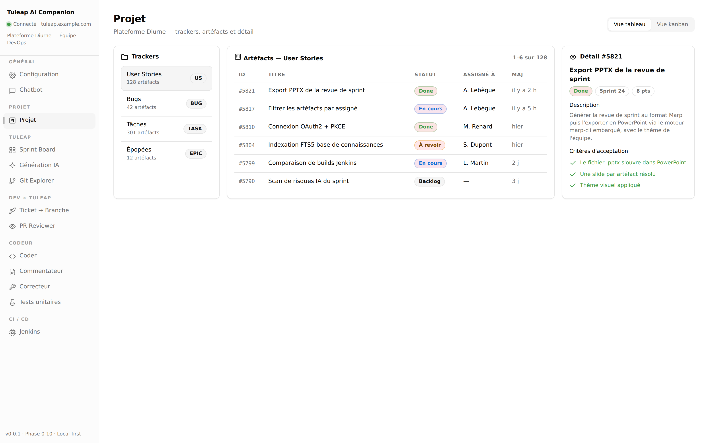
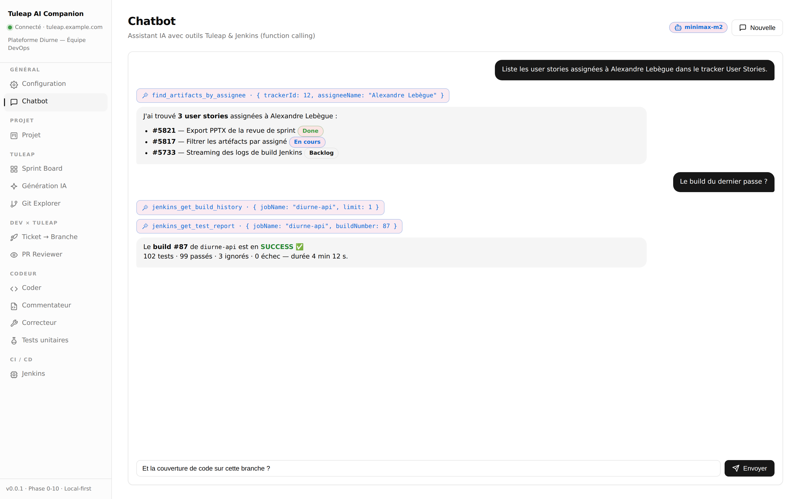
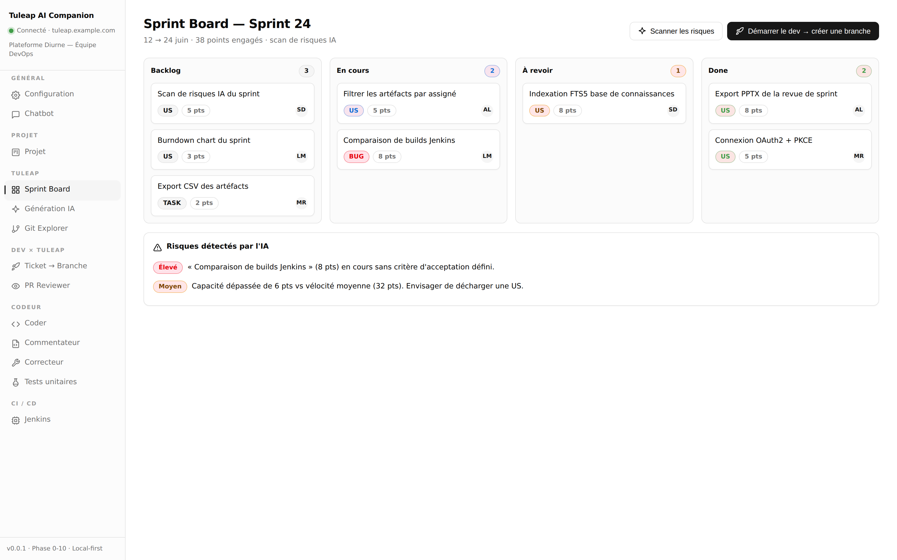
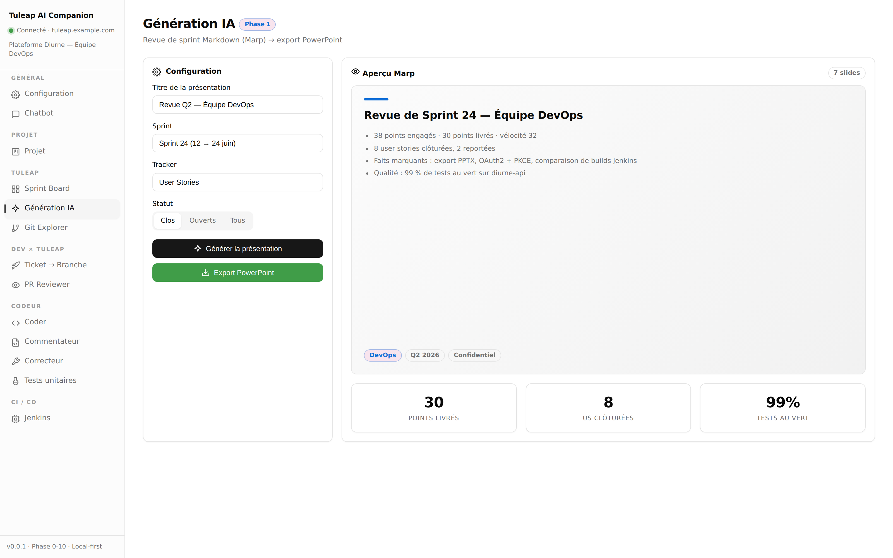
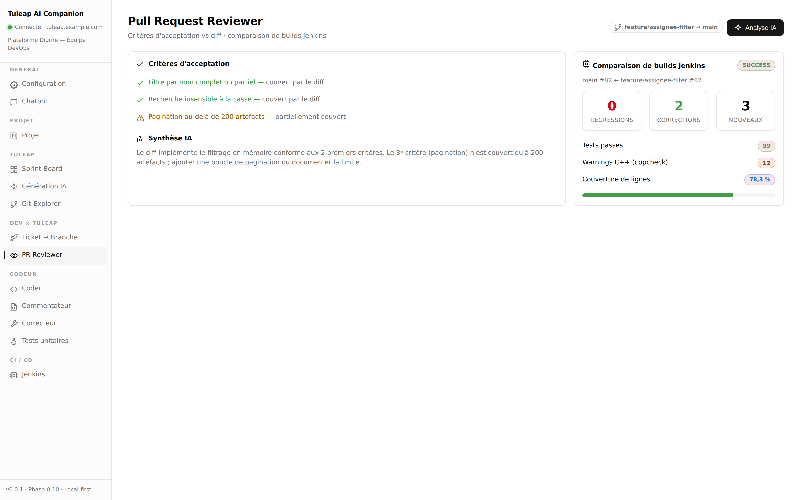
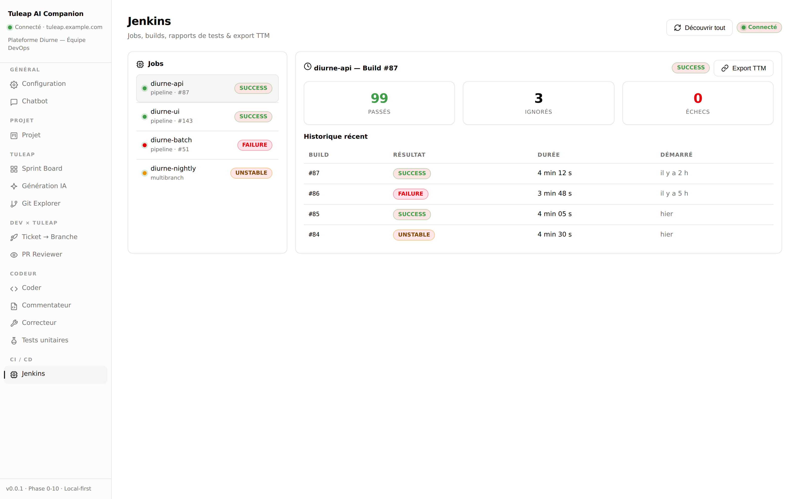
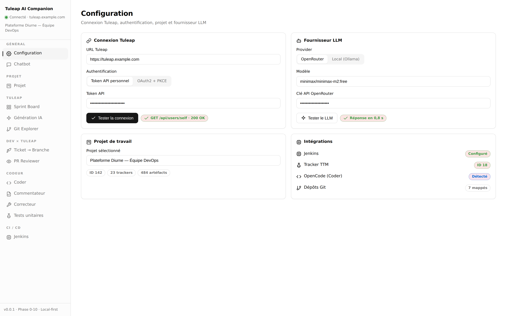

<!-- _class: cover -->
<!-- _paginate: false -->

<div class="kicker">Compagnon IA pour Tuleap ALM</div>

# Tuleap AI&nbsp;Companion

<p class="lead">Une application desktop <strong>local-first</strong> qui connecte vos données Tuleap, votre CI Jenkins et vos dépôts Git à un assistant IA — pour automatiser le suivi de projet, la qualité et le reporting.</p>

<div class="brandrow">
  <span class="logo">✦</span>
  <span class="pill">Electron + React</span>
  <span class="pill">Vercel AI SDK</span>
  <span class="pill">Phases 0 → 10 livrées</span>
</div>

---

## Le constat

Nos équipes jonglent en permanence entre **Tuleap**, **Jenkins** et **Git** — et le travail à faible valeur s'accumule :

- Rédiger les **revues de sprint** à la main, slide par slide
- Chercher « qui fait quoi » et l'état réel d'un ticket dans plusieurs onglets
- Recroiser manuellement **build CI**, **tests** et **critères d'acceptation** d'une PR
- Mettre à jour les statuts Tuleap *après coup*, quand on y pense

<p class="note">Résultat : du temps perdu, des informations dispersées et un reporting toujours en retard.</p>

---

## La solution

# Un copilote unifié, sur le poste

Une seule application qui **lit vos outils**, **raisonne avec l'IA** et **produit des livrables** — sans jamais exposer vos secrets.

<div class="kpis">
  <div class="kpi accent"><b>19</b><span>écrans métier</span></div>
  <div class="kpi"><b>11</b><span>outils IA (Tuleap + Jenkins)</span></div>
  <div class="kpi green"><b>100%</b><span>local-first &amp; chiffré</span></div>
  <div class="kpi"><b>1 clic</b><span>revue de sprint → PPTX</span></div>
</div>

---

## Architecture & stack

<div class="cols left">
<div class="col-text">

- **Electron 39** + **React 19** + TypeScript strict
- **Tailwind v4** + shadcn/ui (style new-york)
- **Vercel AI SDK v6** — function calling & agentic loop
- Providers LLM enfichables : **OpenRouter** ou **local (Ollama)**
- **Zod** valide chaque réponse Tuleap/Jenkins
- **SQLite** : audit log + conversations + index FTS5

</div>
<div class="col-img">

```text
 Renderer (React)
      │  IPC sécurisé
 Main (Node)
   ├─ Tuleap REST  (Zod)
   ├─ Jenkins API  (Zod)
   ├─ Git / OpenCode
   └─ LLM provider ─ tools
```

</div>
</div>

<p class="note">Toutes les requêtes externes passent par le process principal. Le renderer ne contacte aucun host : CSP <code>connect-src 'self'</code>.</p>

---

<!-- _class: section -->
<!-- _paginate: true -->

<div class="kicker">Visite guidée</div>

# Les fonctionnalités, écran par écran

<p class="note">Projet · Chatbot · Sprint Board · Génération IA · PR Reviewer · CI/CD · Configuration</p>

---

## Projet — explorer Tuleap sans friction

<div class="cols">
<div class="col-text">

- Trackers, **artéfacts paginés**, panneau de détail
- Vue **tableau** ou **kanban**
- Statuts, assignés et **critères d'acceptation** d'un coup d'œil
- Base de toutes les actions IA

</div>
<div class="col-img">



</div>
</div>

---

## Chatbot — l'IA qui interroge vos outils

<div class="cols">
<div class="col-text">

- **Function calling** : l'IA appelle les bons outils
- Exemple : *« les US assignées à Alexandre »* → filtrage réel
- Chaîne **Jenkins → tests** automatiquement
- Conversations **persistées**, écritures sous **confirmation**

</div>
<div class="col-img">



</div>
</div>

---

## Sprint Board — pilotage & risques IA

<div class="cols">
<div class="col-text">

- **Backlog + Kanban** par workflow Tuleap
- Glisser-déposer, capacité & vélocité
- **Scan de risques par IA** : surcharge, critères manquants
- *« Démarrer le dev »* → crée la branche Git

</div>
<div class="col-img">



</div>
</div>

---

## Génération IA — revue de sprint → PowerPoint

<div class="cols">
<div class="col-text">

- L'IA rédige la revue à partir des **artéfacts résolus**
- Aperçu **Marp** en direct, thème de l'équipe
- **Export PPTX en un clic** (moteur marp-cli embarqué)
- Fini les slides recopiées à la main

</div>
<div class="col-img">



</div>
</div>

---

## PR Reviewer — qualité avant le merge

<div class="cols">
<div class="col-text">

- **Critères d'acceptation** confrontés au diff par l'IA
- **Comparaison de builds Jenkins** : régressions vs corrections
- Tests, **warnings C++**, **couverture** sur la branche
- Synthèse actionnable, commentaire publié sur Tuleap

</div>
<div class="col-img">



</div>
</div>

---

## CI / CD — Jenkins intégré

<div class="cols">
<div class="col-text">

- **Découverte automatique** des jobs (dossiers, multibranch)
- Historique, détail de build, **rapports JUnit**
- **Export vers Tuleap TTM** : campagnes de test alimentées
- Analyse IA de la **cause racine** d'un échec

</div>
<div class="col-img">



</div>
</div>

---

## Configuration — prête en 2 minutes

<div class="cols">
<div class="col-text">

- Token **API** ou **OAuth2 + PKCE**
- Choix du **projet** de travail
- LLM **OpenRouter** ou **local**
- Intégrations **Jenkins**, **TTM**, **Git**, **OpenCode**

</div>
<div class="col-img">



</div>
</div>

---

## Sécurité & confidentialité

<div class="grid">
  <div class="item"><b>Secrets chiffrés</b><p>Token Tuleap, clé LLM et bundle OAuth2 chiffrés via <code>safeStorage</code>, jamais renvoyés au renderer.</p></div>
  <div class="item"><b>Isolation stricte</b><p><code>contextIsolation</code>, <code>sandbox</code>, <code>nodeIntegration:false</code> + CSP verrouillée.</p></div>
  <div class="item"><b>Sortie LLM non fiable</b><p>Aperçu Marp rendu en <code>iframe sandbox</code> avec sa propre CSP <code>default-src 'none'</code>.</p></div>
  <div class="item"><b>Audit complet</b><p>Chaque appel Tuleap, LLM, outil, export et spawn tracé en base SQLite locale.</p></div>
</div>

---

## Bénéfices pour l'équipe

<div class="kpis">
  <div class="kpi green"><b>−80%</b><span>temps de reporting de sprint</span></div>
  <div class="kpi accent"><b>1 vue</b><span>Tuleap + Jenkins + Git</span></div>
  <div class="kpi"><b>0 secret</b><span>quitte le poste de travail</span></div>
</div>

- Moins de saisie manuelle, **plus de cohérence** entre outils
- Qualité **avant** le merge, traçabilité tests ↔ tickets
- Adoptable **sans changer** d'instance Tuleap ni de CI

---

## Roadmap

<div class="grid">
  <div class="item"><b>Notifications temps réel</b><p>Builds terminés, tickets assignés modifiés, PR à relire.</p></div>
  <div class="item"><b>Détecteur de tests flaky</b><p>Fréquence PASS/FAIL sur l'historique → ticket Tuleap.</p></div>
  <div class="item"><b>Déclenchement de builds</b><p>Lancer un job paramétré depuis l'app.</p></div>
  <div class="item"><b>Tableau de bord personnel</b><p>Mes tickets, mes builds, mes PR en un écran d'accueil.</p></div>
</div>

---

<!-- _class: cover -->
<!-- _paginate: false -->

<div class="kicker">Merci</div>

# Des questions&nbsp;?

<p class="lead">Tuleap AI Companion — un copilote local-first pour fluidifier le quotidien ALM de l'équipe.</p>

<div class="brandrow">
  <span class="logo">✦</span>
  <span class="pill">Electron + React + IA</span>
  <span class="pill">Local-first &amp; chiffré</span>
</div>
